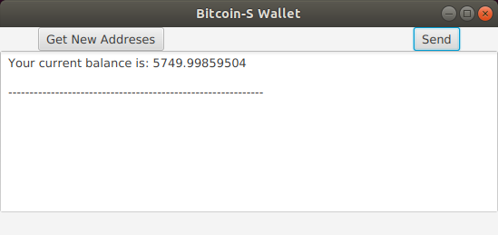

## Bitcoin-S Graphical User Interface
There is now a GUI built using [scalafx](https://www.scalafx.org/) to allow users who do not wish to use the [command line interface](cli.md) to interact with a Bitcoin-S wallet.
This GUI is currently very minimal and looks something like this:



At the time of writing this document, creating addresses and sending Bitcoin are the only supported wallet functionalities in the wallet's RPC API. The expansion of this interface will enable a more robust GUI and this issue is being tracked [here](https://github.com/bitcoin-s/bitcoin-s/issues/1284).

### Running the GUI

> It is required to use java11 to run the GUI

There are two ways to run the GUI

#### Bundled version (easy)

This command will start both the [bitcoin-s server](server.md) and the GUI at the same time

```bashrc
sbt bundle/run
```

#### Standalone version (advanced)

The GUI will only function properly if it can connect to the [bitcoin-s server](server.md) which must be
running in the background before running the GUI.

To run the gui, simply execute

```bashrc
sbt gui/run
```

The gui can be built into an executable using the [sbt native packager](https://www.scala-sbt.org/sbt-native-packager/).

### ScalaFX

[ScalaFX](https://www.scalafx.org/) is a scala library wrapping [JavaFX](https://openjfx.io/) which is itself a java interface to [GTK](https://www.gtk.org/) (which is useful to know when googling for answers as it is easier to search for answers in GTK or sometimes javafx and then translate them to scalafx).

ScalaFX itself requires the dependency

```scala
"org.scalafx" %% "scalafx"
```

but full use of the library requires also adding these dependencies:

```scala
"org.openjfx" % "javafx-base"
"org.openjfx" % "javafx-controls"
"org.openjfx" % "javafx-fxml"
"org.openjfx" % "javafx-graphics"
"org.openjfx" % "javafx-media"
"org.openjfx" % "javafx-swing"
"org.openjfx" % "javafx-web"
```

which for some reason must all be classified by the OS of the machine they are running on.

A GUI can now be built by creating an object which extends `scalafx.application.JFXApp` and setting the `stage` var to a `new JFXApp.PrimaryStage` whose `scene` is your `Node` (where `Node` is the super-class in this framework for all GUI elements).

#### ScalaFX Examples

Aside from looking at how the Bitcoin-S GUI is implemented, for more useful examples of ScalaFX, see [these tutorials](https://github.com/scalafx/ScalaFX-Tutorials) and specifically [this one](https://github.com/scalafx/ScalaFX-Tutorials/tree/master/slick-table) which I think is most illustrative.

